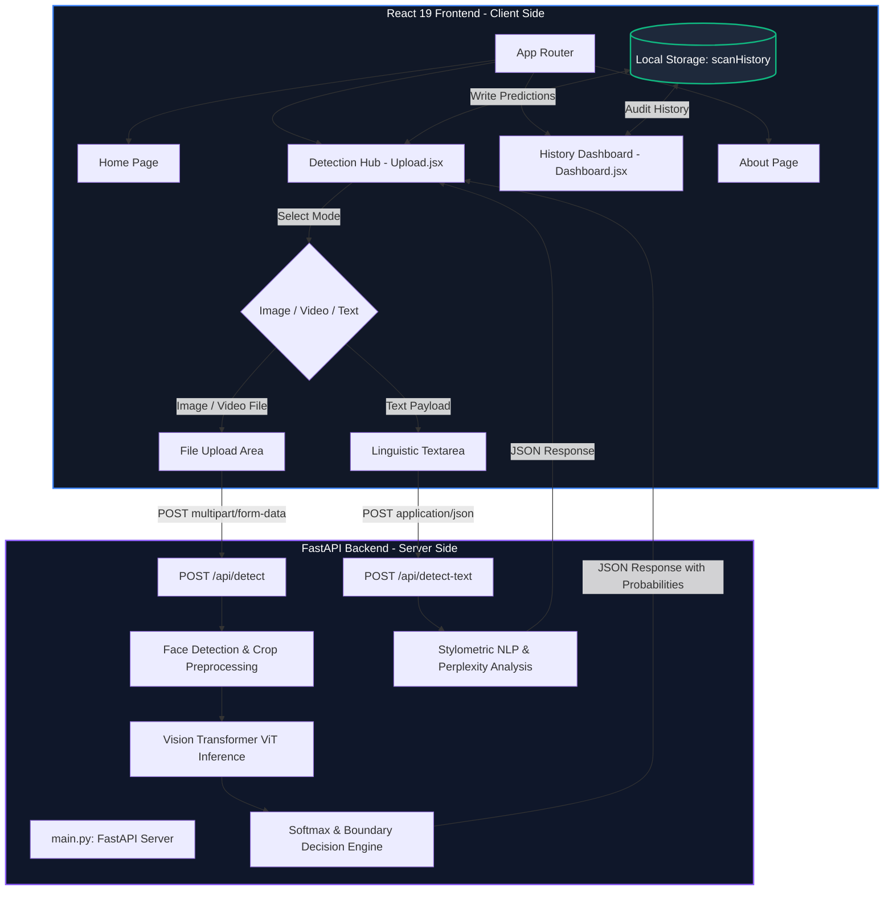

# 🛡️ RealNetra: Production Vision Transformer Deepfake Detector

[](https://opensource.org/licenses/MIT)
[](https://fastapi.tiangolo.com/)
[](https://pytorch.org/)
[](https://huggingface.co/)
[](https://react.dev/)
[](https://vitejs.dev/)

A modern, full-stack cybersecurity application powered by a genuine **Vision Transformer (ViT)** neural network for media authenticity and deepfake detection. RealNetra pairs a glassmorphic React 19 interface with a high-performance FastAPI ML inference backend.

---

## 🔬 Real Machine Learning Architecture

Unlike basic metadata heuristics or simulated score generators, RealNetra uses genuine deep learning model inference:

### 1. Primary Image & Video Detection Model
*   **Model Identifier**: [`dima806/deepfake_vs_real_image_detection`](https://huggingface.co/dima806/deepfake_vs_real_image_detection)
*   **Base Architecture**: `google/vit-base-patch16-224-in21k` (Vision Transformer with 16x16 patch projection and multi-head self-attention).
*   **Model Source**: Hugging Face Hub (PyTorch & HuggingFace Transformers).
*   **Input Requirements**:
    *   **Resolution**: $224 \times 224$ pixels.
    *   **Color Channels**: 3-channel RGB.
    *   **Normalization**: $\text{Mean} = (0.5, 0.5, 0.5)$, $\text{Std} = (0.5, 0.5, 0.5)$.
*   **Class Mapping**:
    *   `0`: `Real` (Authentic face image)
    *   `1`: `Fake` (Deepfake / manipulated face image)
*   **What it Detects**: Face-swaps, digital facial manipulation, autoencoder-generated fakes, and synthetic facial anomalies.

### 2. Preprocessing & Face Localization Pipeline
```text
Raw Uploaded Media (Image / Video)
              │
              ▼
   Face Detection (OpenCV Haar Cascade)
              │
    ┌─────────┴─────────┐
    ▼                   ▼
Face Found          No Face Found
    │                   │
Crop Face (+20% pad) Use Center/Full Frame
    │                   │
    └─────────┬─────────┘
              ▼
ViT Image Normalization (224x224 RGB, μ=0.5, σ=0.5)
              │
              ▼
Vision Transformer Inference (PyTorch torch.no_grad())
              │
              ▼
Softmax Probability & Calibrated Three-State Classification
(REAL / DEEPFAKE / UNCERTAIN)
```

### 3. EXIF Metadata Policy
EXIF metadata (Camera Make, Model, DateTime, Software tags) is parsed solely for **informational forensic display**. 
*   **Camera EXIF present**: Does **NOT** automatically grant a `REAL` verdict.
*   **EXIF stripped / missing**: Does **NOT** flag an image as `DEEPFAKE` (common on web, WhatsApp, and social media images).
*   The final verdict is derived **100% from Vision Transformer neural network inference**.

### 4. Calibrated Three-State Decision Boundary
To prevent forcing false positives or false negatives on borderline or compressed media, RealNetra implements an **`UNCERTAIN`** state:
*   $\text{Fake Probability} > 60\% \implies$ **`DEEPFAKE`**
*   $\text{Fake Probability} < 40\% \implies$ **`REAL`**
*   $40\% \le \text{Fake Probability} \le 60\% \implies$ **`UNCERTAIN`** (ambiguous features, model prompts manual inspection).

---

## 🛠️ System Architecture



---

## 🚀 Deployment Architecture & Vercel Compatibility

> [!IMPORTANT]
> **Can Vercel run the Deepfake ML model directly?**
> **No.** Vercel Serverless Functions have strict platform constraints:
> 1. Maximum package bundle limit: **50 MB** (or 250 MB unzipped on paid plans).
> 2. PyTorch CPU wheels + Torchvision + ViT model weights require ~**650 MB**, which exceeds serverless limits.
> 3. Serverless environments lack native PyTorch acceleration and persistent in-memory model weight caching.

### Recommended Production Topology
```text
React 19 Frontend (Hosted on Vercel)
        │
        ▼ (HTTPS REST API Requests)
FastAPI Python Backend (Hosted on Render / Railway / Fly.io / AWS EC2 / Hugging Face Spaces)
        │
        ▼
Vision Transformer Model in Memory (PyTorch)
```

*   **Frontend**: Deployed to Vercel. Set `VITE_API_URL` environment variable to your deployed FastAPI backend URL.
*   **Backend**: Deployed on Render using the included `render.yaml` Blueprint:
    *   **Build Command**: `pip install --no-cache-dir torch --index-url https://download.pytorch.org/whl/cpu && pip install --no-cache-dir -r backend/requirements.txt`
    *   **Start Command**: `cd backend && uvicorn main:app --host 0.0.0.0 --port $PORT --workers 1`

---


## ⚡ Getting Started (Local Development)

### Prerequisites
*   **Node.js (v18+)**
*   **Python (3.10+)**

### 1. Setup Backend
```bash
cd backend

# Create virtual environment
python -m venv venv

# Activate virtual environment
# Windows:
venv\Scripts\activate
# macOS/Linux:
source venv/bin/activate

# Install ML dependencies
pip install -r requirements.txt

# Run backend server
uvicorn main:app --reload --host 127.0.0.1 --port 8000
```
Interactive Swagger documentation is available at `http://127.0.0.1:8000/docs`.

### 2. Run Verification Test Suite
Verify that all test cases (phone photos with EXIF, web photos without EXIF, screenshots, compressed images, boundary cases) pass through the real ML pipeline without heuristic bias:
```bash
cd backend
python test_suite.py
```

### 3. Setup Frontend
```bash
cd frontend

# Install dependencies
npm install

# Run Vite dev server
npm run dev
```
Open `http://localhost:5173` in your browser.

---

## 📡 API Endpoints

### 1. `POST /api/detect`
Used by Image and Video scanners. Accepts `multipart/form-data` with `file`.

**Sample Response (Real Image with stripped EXIF)**:
```json
{
  "filename": "web_download.jpg",
  "type": "image/jpeg",
  "result": "REAL",
  "confidence": 82.95,
  "details": {
    "model_used": "Vision Transformer (dima806/deepfake_vs_real_image_detection)",
    "faces_detected": 1,
    "face_crop_applied": true,
    "real_probability": 82.95,
    "fake_probability": 17.05,
    "explanation": "Natural facial feature distribution and authentic pixel coherence verified by Vision Transformer.",
    "metadata_forensics": {
      "has_exif": false,
      "camera_make": "Unknown / Stripped",
      "camera_model": "Unknown / Stripped",
      "software": "Not Specified",
      "date_time": "N/A",
      "fields_detected": 0
    }
  }
}
```

**Sample Response (Ambiguous / Boundary Image)**:
```json
{
  "filename": "compressed_crop.jpg",
  "type": "image/jpeg",
  "result": "UNCERTAIN",
  "confidence": 53.11,
  "details": {
    "model_used": "Vision Transformer (dima806/deepfake_vs_real_image_detection)",
    "faces_detected": 0,
    "face_crop_applied": false,
    "real_probability": 53.11,
    "fake_probability": 46.89,
    "explanation": "Model confidence is near the decision threshold. Artifact features are ambiguous for a definitive real/fake verdict."
  }
}
```

### 2. `POST /api/detect-text`
Used by the Text Analyzer. Accepts `application/json`.

**Sample Response**:
```json
{
  "filename": "Text Snippet",
  "type": "text/plain",
  "result": "HUMAN WRITTEN",
  "confidence": 85.0,
  "details": {
    "model_used": "Stylometric NLP Pattern & Perplexity Analyzer",
    "sentences_analyzed": 3,
    "ai_probability": 15.0,
    "human_probability": 85.0,
    "ai_markers_count": 0,
    "human_markers_count": 2
  }
}
```

---

## ⚠️ Known Limitations
1.  **Facial Deepfake Domain**: The primary Vision Transformer model is fine-tuned on facial deepfakes (FaceForensics++, Celeb-DF, Deepfake datasets). For non-face scenery, abstract graphics, or text documents, predictions have higher ambiguity and are designed to return `UNCERTAIN` rather than false positives.
2.  **Concept Drift**: As generative AI tools evolve, newer synthesis architectures may produce novel artifacts that differ from older training distributions.

---

## 📄 License
This project is open-source under the [MIT License](https://opensource.org/licenses/MIT).