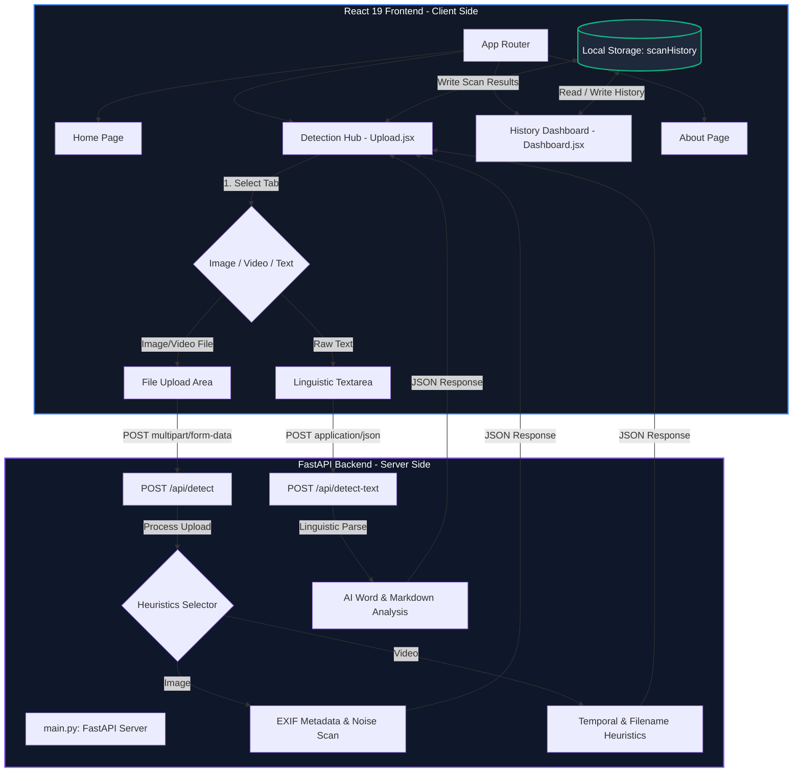

# 🛡️ RealNetra: Deepfake & AI Content Detector

[](https://opensource.org/licenses/MIT)
[](https://fastapi.tiangolo.com/)
[](https://react.dev/)
[](https://vitejs.dev/)

A modern, full-stack application designed to analyze and detect AI-generated media (images and videos) as well as AI-generated text. RealNetra features a premium, glassmorphic dark-mode interface built with React 19, paired with a FastAPI backend that utilizes smart heuristics (like EXIF metadata parsing, linguistic anomaly detection, and filename signature evaluation) to simulate forensic neural networks.

---

## 📸 Interface Preview

*The application presents a state-of-the-art cybersecurity dashboard featuring:*
1. **Interactive Detection Hub**: Dedicated workspaces for Image scanning, Video scanning, and Text analysis.
2. **Neural Scan Simulation**: Multi-stage, beautifully animated sequences showing preprocessing, feature extraction, and neural network classification.
3. **Live History Dashboard**: Dynamic tracking of scans, showing custom stats widgets, confidence scores, and local audit logs.

---

## 🛠️ System Architecture

The following diagram illustrates how the RealNetra frontend and backend communicate, including the data persistence flow:



---

## 🌟 Key Features

*   🖼️ **Image Metadata Forensics**: Inspects uploaded images for camera-specific EXIF metadata. Standard AI generators (e.g., Midjourney, DALL-E) generally strip this data, whereas authentic camera images preserve it.
*   🎥 **Video Signature Scanner**: Detects temporal pattern anomalies and flags suspicious naming formats (e.g., containing deepfake/synth keywords).
*   ✍️ **Linguistic NLP Text Analyzer**: Evaluates text payloads against specific LLM-generated heuristics (e.g., ChatGPT signature phrases like *"delve"*, *"tapestry"*, *"in conclusion"*, combined with sentence length, markdown structure, and avg word length tests).
*   ⏱️ **Dramatic Multi-Stage Scan Animation**: Simulates a high-tech forensic analysis pipeline:
    1. Preprocessing Media (`Database` index checking)
    2. Feature Extraction (`Search` phase)
    3. CNN Model Classification (`Cpu` inference phase)
*   💾 **Persistent Session Tracking**: Stores audit logs locally in the browser (`localStorage`), dynamically calculating overall success rates, fake counts, and displaying an interactive history table.

---

## 📁 Repository Structure

```text
deepfake-detector/
├── backend/
│   ├── main.py              # FastAPI server and core detection heuristic logic
│   ├── requirements.txt     # Python server dependencies
│   └── venv/                # Virtual environment directory (auto-created)
├── frontend/
│   ├── public/              # Static public assets
│   ├── src/
│   │   ├── components/      # Shared components (Navbar, Detector stepper, etc.)
│   │   ├── pages/           # View pages (Home, Upload, Dashboard, About)
│   │   ├── App.jsx          # Router and main layout definition
│   │   ├── index.css        # Glassmorphic UI design tokens & global rules
│   │   └── main.jsx         # React application entry point
│   ├── package.json         # Node.js workspace configuration
│   ├── .env.production      # Production environment configuration template
│   └── vite.config.js       # Vite bundler options
├── run.bat                  # Automated multi-process shell runner (Windows)
├── schema.md                # Data schemas & API contract specifications
└── README.md                # General project documentation
```

---

## ⚡ Getting Started

Ensure you have **Node.js (v18+)** and **Python (3.9+)** installed on your workstation.

### Option A: Quick-Start (Windows)
Double-click [run.bat](file:///c:/Users/SACHIN%20MISHRA/.gemini/antigravity/scratch/deepfake-detector/run.bat) in the project root. This command script automatically spawns:
1. The Python Uvicorn backend server on `http://127.0.0.1:8000`
2. The Vite React client server on `http://localhost:5173`

---

### Option B: Manual Installation

#### 1. Setup Backend
Open a terminal, enter the `backend` directory, and initialize the environment:
```bash
cd backend

# Create virtual environment
python -m venv venv

# Activate virtual environment
# Windows:
venv\Scripts\activate
# macOS/Linux:
source venv/bin/activate

# Install requirements
pip install -r requirements.txt

# Run backend development server
uvicorn main:app --reload --host 127.0.0.1 --port 8000
```
*The interactive Swagger documentation is available at [http://127.0.0.1:8000/docs](http://127.0.0.1:8000/docs).*

#### 2. Setup Frontend
In a separate terminal shell, navigate to the `frontend` folder:
```bash
cd frontend

# Install package dependencies
npm install

# Run Vite dev server
npm run dev
```
*Open your web browser and navigate to [http://localhost:5173](http://localhost:5173).*

---

## 📡 API Endpoints

Detailed API contracts can be reviewed in the [schema.md](file:///c:/Users/SACHIN%20MISHRA/.gemini/antigravity/scratch/deepfake-detector/schema.md) file. The backend runs at `http://127.0.0.1:8000`.

### 1. `POST /api/detect`
Used by the Image and Video scanners. Accepts `multipart/form-data`.
*   **Request**: `file` (binary)
*   **Response Payload**:
    ```json
    {
      "filename": "selfie.png",
      "type": "image/png",
      "result": "REAL",
      "confidence": 97.4,
      "details": {
        "model_used": "Heuristic Metadata + Noise Analysis (Simulated CNN)",
        "faces_detected": 1,
        "artifacts_found": 0
      }
    }
    ```

### 2. `POST /api/detect-text`
Used by the Text Analyzer. Accepts `application/json`.
*   **Request Payload**:
    ```json
    {
      "text": "Furthermore, it is important to note that the tapestry of technology is complex."
    }
    ```
*   **Response Payload**:
    ```json
    {
      "filename": "Text Snippet",
      "type": "text/plain",
      "result": "AI GENERATED",
      "confidence": 94.2,
      "details": {
        "model_used": "Heuristic NLP Pattern Matching (Simulated RoBERTa)",
        "sentences_analyzed": 1,
        "artifacts_found": 3
      }
    }
    ```

---

## 🔍 Heuristic Classification Rules

RealNetra relies on a smart, deterministic scoring model inside [backend/main.py](file:///c:/Users/SACHIN%20MISHRA/.gemini/antigravity/scratch/deepfake-detector/backend/main.py):

*   **Image Detection**: Reads file content bytes utilizing Pillow. If the image metadata contains more than two EXIF fields, it is flagged as `REAL` (authentic photograph). If EXIF metadata is stripped (as standard generative AI platforms do), it is flagged as `DEEPFAKE`.
*   **Video Detection**: Inspects naming conventions. Filenames containing terms like `"fake"`, `"ai"`, or `"synth"` trigger a `DEEPFAKE` verdict; others fall back to `REAL`.
*   **Text Detection**: Performs weighted scanning of the payload:
    *   **AI Indicators (+1 each)**: Common ChatGPT syntax patterns (`"delve"`, `"tapestry"`, `"furthermore"`, `"as an ai"`, `"in conclusion"`).
    *   **Human Indicators (-2 each)**: Conversational syntax (`"tbh"`, `"lol"`, `"honestly"`, `"gonna"`, `"wanna"`).
    *   **Structure Modifier**: Presence of Markdown symbols (`**`, `###`, `- `) increases the AI likelihood score.

---

## 🔮 Future Roadmap

To transition this framework from a heuristic simulation to a production-grade detection system, the following pipeline extensions are planned:
- [ ] **Dual-Path CNN Integration**: Replace the EXIF checker with a fine-tuned ResNet or EfficientNet model for deep-feature artifact analysis.
- [ ] **LSTM / Transformer Temporal Frames**: Extract frames dynamically via OpenCV, passing them to a vision transformer or LSTM backend for temporal flickering and consistency tests.
- [ ] **Fine-tuned RoBERTa-v3/DeBERTa Classifier**: Deploy an open-source huggingface classifier to detect syntactic entropy and perplexity for textual authentication.

---

## ⚠️ Disclaimer

RealNetra is currently built as an educational and UI/UX demonstration framework. The backend simulates neural network output weights based on heuristic parameters rather than live neural-network model inference. It should not be used as a final verification tool in critical production safety workflows.

---

## 📄 License

This codebase is open-source and licensed under the [MIT License](https://opensource.org/licenses/MIT).